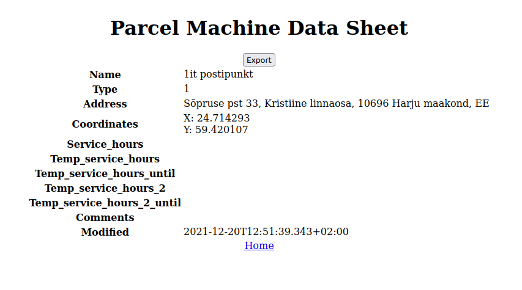
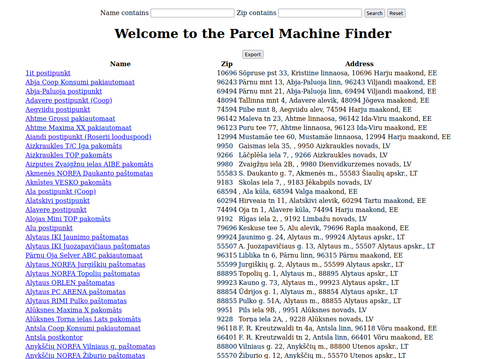

> This project is a Rails based app built as an interview challenge project. Its intention is to maintain up-to-date data using a given resource and manipulate the received data into human readable formats for viewing online or in print.

# Parcel Challenge

## Project Description

The challenge was to synchronize a JSON object from an external source on a nightly basis and display this data to the User. In order to do so, a database must be established to allow the User to view it asynchronously, instead of calling for the data at the User's discretion. Users need no interaction with the database, aside from viewing, so no functionality exists at this time that allows Users to change the stored data. From the display, Users should be able to view, filter, and select any parcel machine to be viewed online or exported in excel format.

#### Features
-   Daily data update
-   Index view of all parcel machines
-   Display view of individually selected parcel machine
-   Option to export filtered data to excel format

###### Coming Features
-   Button to refresh parcel machine data

## Built With
-   Node.js / yarn
-   Ruby / Ruby on Rails
-   JavaScript ES6 / HTML / SCSS
-   Bootstrap

### To Use The App
Enter filter parameters to find the parcel by name, address, or....
Once your desired parcel is found, click the link to view more information.

## Getting Started Locally
### Prerequisities
To get this project up and running locally, you must have the packages necessary to run Ruby on Rails already installed on your computer or be able to install them.

**Step 1** 
Navigate your terminal to the local folder where you want the repository to be cloned to and run
`git clone https://github.com/defoebrand/parcel-challenge.git`. 

**Step 2** 
Enter the project directory by running `cd parcel-challenge`. 

**Step 3** 
Prepare the project dependencies by running `bundle i`. 

**Step 4** 
Setup the database by running `rails db:setup` followed by `rails db:migrate`. 

**Step 5** 
Initialize scheduled tasks by running `whenever -w --set environment=development`. 

**Step 6** 
Start the Rails server by running `rails s`. 

**Step 7** 
Navigate to `http://localhost:3000/` in a browser of your choice to see the application running. 

### Testing
This project uses RSpec for testing Rails features.
> To run tests, open a terminal inside the project's root directory and enter `rspec`

## Author

👤 **Brandon Defoe**

-   Github: [@defoebrand](https://github.com/defoebrand)
-   LinkedIn: [@defoebrand](https://www.linkedin.com/in/defoebrand/)
-   Gmail: <mailto:defoe.brand@gmail.com>

## 🤝 Contributing

Our favorite contributions are those that help us improve the project, so please leave an issue or a feature request if you have any suggestions!

Feel free to check the [issues page](https://github.com/defoebrand/parcel-challenge/issues) to either create an issue or help us out by fixing an existing one.

## Show your support

If you've read this far....give us a ⭐️
